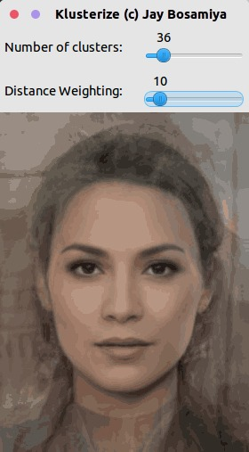
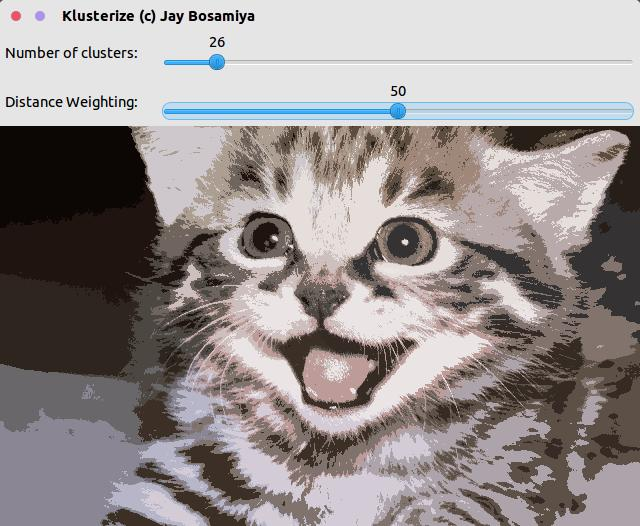

Klusterize
==========

> Posterize images using K-means clustering

Convert  to 

Screenshots
-----------





How it works
------------

The tool takes your image, and runs the [K-means clustering algorithm](https://en.wikipedia.org/wiki/K-means_clustering) on the different pixels, based upon a weighted combination of inter-point distance, and colour difference. This weighting is user-configurable. Using this, it generates a new image in which every pixel has been assigned the colour of its respective cluster.

Usage
-----

```bash
./klusterize input_image output_image
```

Use the Number of Clusters bar to choose how many clusters to use.
Use the Distance Weighting bar to choose how much weight to give to inter-pixel distance (with 100 meaning "only distance matters", and 0 meaning "only colour matters).

Press `s` at any time to save the image, and `q` to quit.

Build process
-------------

```bash
mkdir build
cd build
cmake ..
make
```

Requirements
------------

+ OpenCV 2.x
+ CMake 2.8 or above

License
-------

This software is licensed under the [MIT License](http://jay.mit-license.org/2015)
